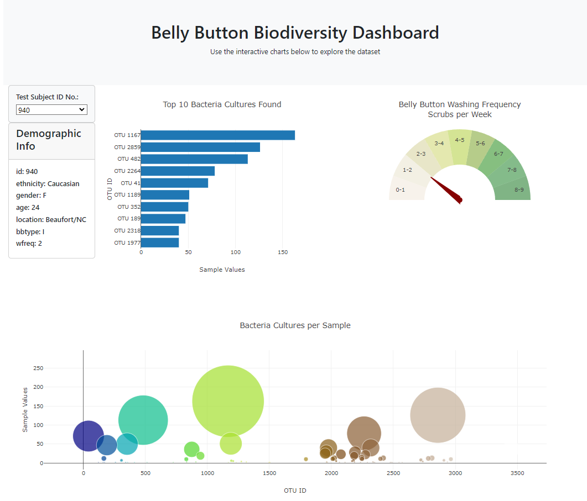

# Belly Button Biodiversity Dashboard - Challenge

This dashboard allows users to explore the Belly Button Biodiversity dataset, which catalogues the microbes that colonize human navels.

## Before You Begin

Before starting the development of this dashboard, the following tasks were completed:

1. **Repository Setup:** Created a new repository for this project called `belly-button-challenge` and cloned it to the local machine.

2. **File Setup:** Copied the files from the `StarterCode` folder contained within the Module 14 Challenge zip file. This includes `index.html`, `samples.json`, and the `static` folder.

3. **GitHub Setup:** Pushed the changes to GitHub, ensuring that the repository has regular commits.

4. **Deployment:** Deployed the new repository to GitHub Pages.

## Description

This dashboard was created as part of an assignment to build an interactive data visualization tool using D3.js and Plotly.js. The task involved reading in the Belly Button Biodiversity dataset and creating visualizations to display the top 10 operational taxonomic units (OTUs) found in each individual's navel, as well as additional demographic information.

The dashboard consists of the following components:

- A dropdown menu to select an individual from the dataset.
- A horizontal bar chart displaying the top 10 OTUs found in the selected individual, with sample values as bar lengths, OTU IDs as labels, and OTU labels as hover text.
- A bubble chart displaying each sample, with OTU IDs for the x-values, sample values for the y-values, marker size based on sample values, marker colors based on OTU IDs, and OTU labels for text values.
- Display of sample metadata, including demographic information, for the selected individual.


    


## Dependencies

To run this dashboard, you will need the following dependencies:

- D3.js (Data-Driven Documents): A JavaScript library for manipulating documents based on data. It is used to read in and manipulate the dataset.

    You can include D3.js in your HTML file by adding the following script tag:

    ```html
    <script src="https://d3js.org/d3.v7.min.js"></script>
    ```

- Plotly.js: A JavaScript graphing library that enables interactive and publication-quality graphs. It is used to create the bar chart and bubble chart in the dashboard.

    You can include Plotly.js in your HTML file by adding the following script tag:

    ```html
    <script src="https://cdn.plot.ly/plotly-latest.min.js"></script>
    ```

## Usage

1. Clone the repository to your local machine:

    ```
    git clone <repository_url>
    ```

2. Open the `index.html` file in a web browser.

3. Interact with the dashboard by selecting different individuals from the dropdown menu. The dashboard will update to display the top 10 OTUs found in the selected individual, along with a bubble chart and sample metadata.

## References

- https://git.bootcampcontent.com/University-of-Adelaide/UADEL-VIRT-DATA-PT-12-2023-U-LOLC
- D3.js: https://d3js.org/
- Plotly.js: https://plotly.com/javascript/

This dashboard was created as part of an assignment. The dataset used in this dashboard is from the Belly Button Biodiversity study.
